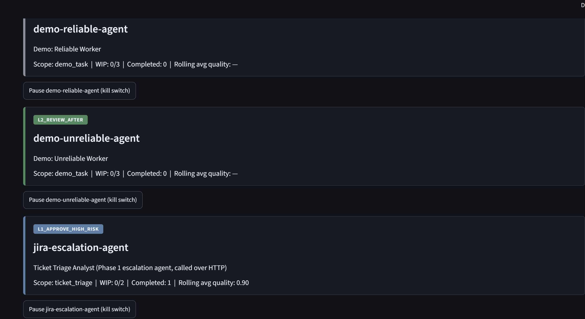
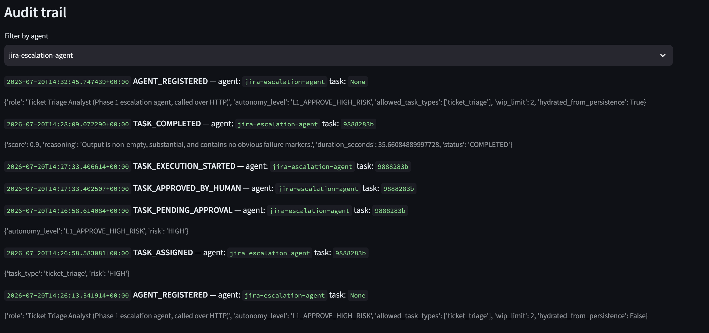
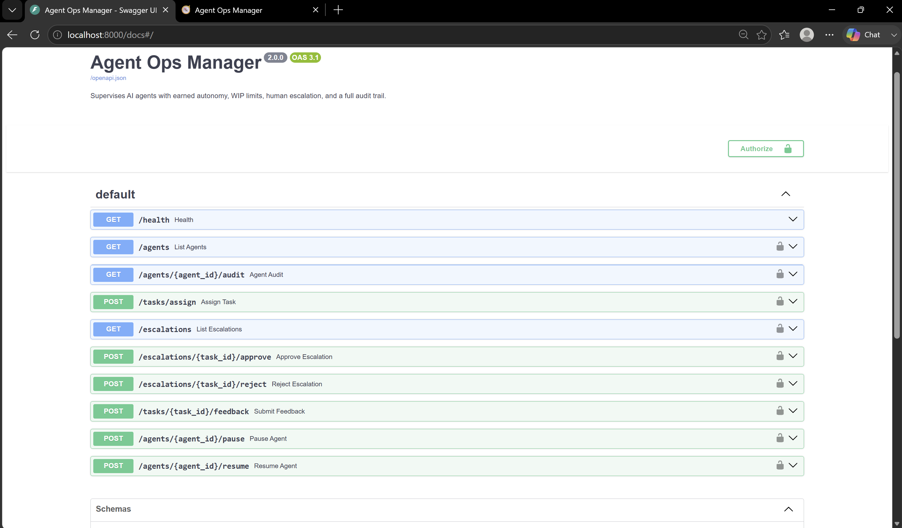
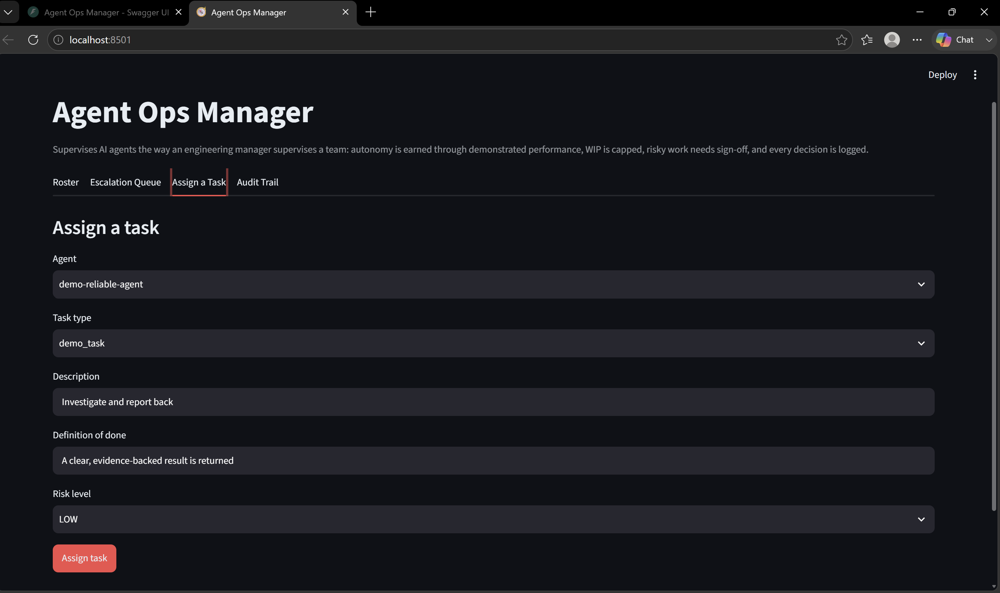

# Agent Ops Manager


This project supervises AI agents the way a manager supervises a new team member. An agent does not get full trust on day one. It earns more freedom over time by doing good work. Until then, its work is capped and risky actions need a human's sign-off. Every decision the system makes (assigning work, approving something, promoting or demoting an agent) gets written to an audit log, so you can always see what happened and why.

This is Phase 2 of a two-part project. [Phase 1](https://github.com/abhirupray/escalation-agent) is a real agent that reads Jira tickets and meeting notes. This repo is the layer that supervises it, calling it over a real network connection, not just importing its code.

## Screenshots

**Live roster.** The real escalation agent, registered next to two demo agents, after a real run (1 completed task, 0.90 quality score):



**Full audit trail** for that same agent, from assignment to human approval to completion, all timestamped. Look at the second `AGENT_REGISTERED` entry: it shows `hydrated_from_persistence: True`, which means the agent's earned trust and history survived a restart. That was proven in a real run, not just in a test:



**API docs.** Every endpoint needs authentication except `/health` (see the lock icons). FastAPI builds this page automatically from the code:



**Assigning a task from the dashboard.** The same task-assignment flow that exists in the API, available through a simple UI:



## Why I built this

A few 2026 surveys on enterprise AI adoption point to the same problem: most AI agent pilots never make it to production, and it is usually not because the agent is not smart enough. It is because nobody trusts it enough to give it real responsibility. Some companies have said they could not even switch an agent off quickly if it started misbehaving.

There is a simple idea that keeps coming up in engineering-leadership writing: manage an AI agent the way you would manage a new hire. Give it a clear scope, a clear definition of "done," and let it earn more autonomy as it proves itself. I had not seen this built as actual working software, so I built it. It is not a new idea. What I am contributing is a working version of it, along with the reasoning behind every choice, written down in [DECISIONS.md](DECISIONS.md).

## How it works

```
                      ┌─────────────────────┐
 Task submitted  ───▶ │                      │
                      │      Supervisor       │
                      │  (src/core/supervisor)│
                      └──────────┬────────────┘
                                 │
            ┌────────────────────┼────────────────────┐
            ▼                    ▼                     ▼
    WIP limit check      Autonomy check          Audit log
    (per agent cap)      (pre-approval needed?)  (every decision,
                                 │                 append-only)
                  ┌──────────────┴──────────────┐
                  ▼                              ▼
          Runs immediately              Queued for human approval
                  │                              │
                  ▼                    (approve) ▼  (reject)
          ┌───────────────┐          Runs immediately   Task rejected
          │  Worker agent  │
          │ (any AgentWorker)
          └───────┬────────┘
                  ▼
          Quality checker scores the output
          against the task's definition_of_done
                  │
      ┌────────────┴────────────┐
      ▼                          ▼
Updates rolling quality    A low score at ANY autonomy
history, may trigger        level still gets flagged for
promotion or demotion       human review, after the fact
(every 5 completed tasks)
```

**The autonomy ladder:**

| Level | What it means |
| ----- | ----------------------------------------------------------------------- |
| L0    | Every task needs human approval first |
| L1    | Low and medium risk tasks run on their own; high risk still needs approval |
| L2    | Agent works on its own; every result gets reviewed afterward |
| L3    | Agent works on its own; only a sample of results gets checked |
| L4    | Fully independent; only checked if something looks wrong |

Agents start low on this ladder. Every 5 completed tasks, the system looks at their average quality score and decides whether to move them up or down. DECISIONS.md explains why this happens on a schedule instead of after every single task.

**Trust-based routing.** Instead of picking which agent gets a task yourself, `supervisor.route_task(task)` can do it for you. It picks the most trusted agent that is free and scoped for the job. New agents get a small benefit of the doubt at first, so they are not stuck waiting for work while they build a track record (`src/core/router.py`).

**Human feedback.** If a person disagrees with an automated quality score, `supervisor.record_human_feedback(task_id, corrected_score, note)` lets them correct it. That correction becomes part of the agent's trust history from then on, and it is logged too (`src/core/feedback.py`). This is one honest way a system like this can improve with use: the model itself does not change, but the supervision around it gets better calibrated.

## Setup

```bash
git clone <your-repo-url>
cd agent-ops-manager
python -m venv venv && source venv/bin/activate
pip install -r requirements.txt
cp .env.example .env
```

You do not need an API key to run the tests, the demo script, or the dashboard with the built-in demo agents. You only need one if you want to connect the real Phase 1 agent, or if you want to use `LLMQualityChecker` instead of the simpler default scorer.

## Usage

**Run the tests** (no API key needed, everything here is deterministic)
```bash
pytest tests/ -v
```

**Watch the whole system run in one scripted demo** (promotion, demotion, escalation, and the kill switch, in that order)
```bash
python -m demo.run_demo
```

**Dashboard**
```bash
streamlit run app/streamlit_app.py
```

**API**
```bash
uvicorn src.api.main:app --reload
# GET  http://localhost:8000/agents
# POST http://localhost:8000/tasks/assign
# GET  http://localhost:8000/escalations
# POST http://localhost:8000/escalations/{task_id}/approve
# POST http://localhost:8000/agents/{agent_id}/pause   <- the kill switch
```

**Docker (API and dashboard together)**
```bash
docker compose up --build
```

## Connecting the real escalation-agent service

As of v2.1, this is a genuine two-service setup. escalation-agent runs as its own API, and this repo talks to it over HTTP (DECISIONS.md explains why I moved away from an earlier approach that imported its code directly, and what that cost). Both services need to be running at the same time, each in its own terminal and its own virtual environment:

**Terminal 1, escalation-agent:**
```bash
cd escalation-agent
source venv/bin/activate
uvicorn src.api.main:app --port 8001
```

**Terminal 2, agent-ops-manager:**
```bash
cd agent-ops-manager
source venv/bin/activate
# In .env: ESCALATION_AGENT_URL=http://localhost:8001 (this is already the
# default, so you only need to set it if escalation-agent runs somewhere
# else). If escalation-agent has ESCALATION_AGENT_API_KEY set, set the same
# value here too.
python scripts/run_governed_triage.py
```

This script pulls every open ticket straight from escalation-agent's live `/tickets` endpoint. Nothing is hardcoded. Each ticket then goes through this supervisor, so WIP limits, the autonomy ladder, approval gates on risky tickets, quality scoring, and the audit trail all apply. Add `--auto-approve` if you want it to run without stopping for approvals.

The bootstrap module (`src/bootstrap.py`) checks whether escalation-agent is reachable when it starts up, and only registers it as `jira-escalation-agent` if it is. It starts at autonomy level L1. The demo agents work fine either way.

To call it directly instead of through the script:
```python
from src.bootstrap import get_supervisor
from src.integrations.escalation_agent_http_worker import make_ticket_triage_task
from src.core import TaskRisk

supervisor = get_supervisor()
task = make_ticket_triage_task("PROJ-104", risk=TaskRisk.HIGH)
result = supervisor.assign_task("jira-escalation-agent", task)
```

## Writing your own worker agent

Any object with a `.run(task: Task) -> Any` method can be supervised. See `src/core/worker.py` for the interface, which is kept as small as possible, and `src/integrations/demo_worker.py` for the simplest examples.

## Ideas for taking this further

1. Swap `HeuristicQualityChecker` for `LLMQualityChecker` (or your own) when you want real judgment on quality, not just a shape check.
2. Swap SQLite for a tamper-evident audit store if this ever needs to meet real compliance requirements (see DECISIONS.md).
3. Add real mid-task cancellation to the kill switch if agents run asynchronously in your setup (this is a known, stated gap right now, see DECISIONS.md).
